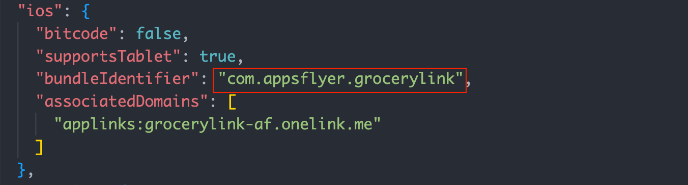

## Make It Your Own
### 1. Choose a custom package name(Android) or bundle identifier(iOS) 
To run and test this project locally, you will need to change your project's package name/bundle identifier. You can set your own package name/bundle identifier in the `app.json`.

### 2. Create apps on your Appsflyer account
Go to your AppsFlyer account and create an iOS or Android app(or both). Learn more [here](https://support.appsflyer.com/hc/en-us/articles/207377436-Adding-a-new-app#:~:text=Adding%20an%20app,click%20the%20Add%20app%20button).

### 3. Add your dev key and app ID
- Go to `components/AppsFlyer/InitializeSDKHandler.js`.
- Change the `devKey` to your key. 
- If you are using an iOS app, add your `appID`. Else, do not change it.

### 4. Create a test template and link
- We want to create a link that will add an item to the users' grocery list once they will click it.
- Create a OneLink template. Learn more [here](https://support.appsflyer.com/hc/en-us/articles/208874366-OneLink-links-and-experiences).
- Create a new OneLink custom link.
- In the new link:
  - Set the `deep link value` to your desired category('Vegetables', 'Fruits', etc. Full categories options are in `local_data/Categories.json`).
  - Under the *Additional Parameters* section, add a custom parameter name `deep_link_sub1` with an Item from the category above(Full items options are in `local_data/Categories.json`). 
  - Add another custom parameter name `deep_link_sub2` and set it to the units mode of the item(`true` for units, `false` for kilograms).
  - Add another custom parameter name `deep_link_sub3` and set it to the quantity of the item.
### 5. Associated Domains
- Copy your template subdomain(with the extension `.onelink.me`). 
- Go to `app.json`
- For Android - paste it into the `"host"` key, and add your `template ID` to the `"pathPrefix"` key.
- For iOS - add the subdomain to the `"associatedDomains"` key.

### 6. User Invite(optional)
- Go to `components/AppsFlyer/UserInviteHandler.js`.
- Copy your custom template ID and paste it here.

### 7. Build your app and run it on your device
> We highly recommend running and testing your app on a real iOS or Android device(and not a simulated one).

### 8. Click on your link, get an item or send one to your friends!
- Now that your app is running, click the link and see your DeepLink item in the `Modal` window.
- If you accept the item, it will automatically be added to your list.
- You can send an item to a friend using the **Share** screen, and generate your own links.
